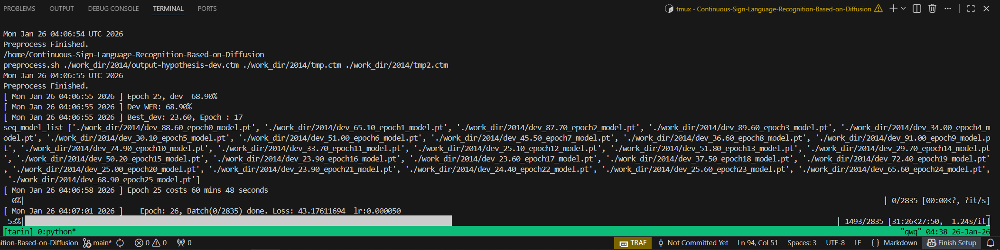
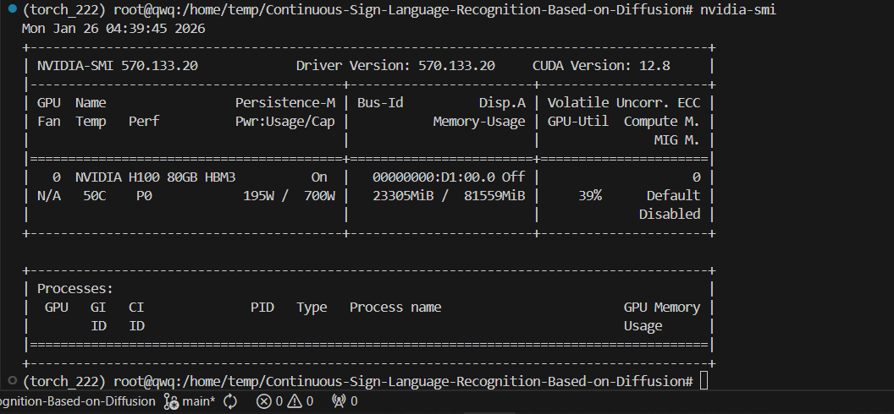

## Notification

This repository has undergone significant refactoring due to several critical issues found in the original implementation. During the development process, the following major discrepancies and bugs were identified and addressed:

- Logical Inconsistencies & Redundancies: The original codebase contained various structural flaws, such as duplicate variable definitions (e.g., multiple instances of self.decode) which caused unpredictable behavior during execution.

- Module Mismatch (RSM & GFE): There were severe discrepancies between the provided code and the theoretical implementation of the Recognition-oriented Supervision Module (RSM) and Gloss-level Feature Representation Enhancement (GFE). The logic in the original scripts did not align with the author's intended architectural design.

- Dimensionality Conflicts: Critical bugs were found in the data flow, where input dimensions often failed to align, leading to runtime crashes during training and inference.

To ensure the reliability and reproducibility of the project, these components have been heavily debugged and restructured. This fork serves as a corrected and more stable version of the original project.

## Prerequisites

**Docker**: Use the provided Dockerfile for a quick setup:

**Dependencies**: `pip install -r requirements.txt`

**SCLite**: Run `bash install_kaldi_stack.sh`, then link the binary: 
`ln -s /<PATH_TO_KALDI>/tools/sctk-2.4.10/bin/sclite ./software/sclite`

**Pretrained Models**
This project requires the MBart_trimmed model for initialization. You can obtain the weights and reference the configuration from the following repository:
MBart_trimmed: [[GFSLT-VLP Repository]](https://www.google.com/search?q=https://github.com/zhoubenjia/GFSLT-VLP/tree/main/pretrain_models)<br>
Please ensure the downloaded files are placed in the ./pretrain_models/MBart_trimmed directory.

## Data Preparation

### PHOENIX2014 dataset
1. Download the RWTH-PHOENIX-Weather 2014 Dataset [[download link]](https://www-i6.informatik.rwth-aachen.de/~koller/RWTH-PHOENIX/). Our experiments based on phoenix-2014.v3.tar.gz.

2. After finishing dataset download, extract it. It is suggested to make a soft link toward downloaded dataset.   
   `ln -s PATH_TO_DATASET/phoenix2014-release ./dataset/phoenix2014`

3. The original image sequence is 210x260, we resize it to 256x256 for augmentation. Run the following command to generate gloss dict and resize image sequence.     

   ```bash
   cd ./preprocess
   python dataset_preprocess.py --process-image --multiprocessing
   ```

### PHOENIX2014-T dataset
1. Download the RWTH-PHOENIX-Weather 2014 Dataset [[download link]](https://www-i6.informatik.rwth-aachen.de/~koller/RWTH-PHOENIX-2014-T/)

2. After finishing dataset download, extract it. It is suggested to make a soft link toward downloaded dataset.   
   `ln -s PATH_TO_DATASET/PHOENIX-2014-T-release-v3/PHOENIX-2014-T ./dataset/phoenix2014-T`

3. The original image sequence is 210x260, we resize it to 256x256 for augmentation. Run the following command to generate gloss dict and resize image sequence.     

   ```bash
   cd ./preprocess
   python dataset_preprocess-T.py --process-image --multiprocessing
   ```

### CSL dataset

1. Request the CSL Dataset from this website [[download link]](https://ustc-slr.github.io/openresources/cslr-dataset-2015/index.html)

2. After finishing dataset download, extract it. It is suggested to make a soft link toward downloaded dataset.   
   `ln -s PATH_TO_DATASET ./dataset/CSL`

3. The original image sequence is 1280x720, we resize it to 256x256 for augmentation. Run the following command to generate gloss dict and resize image sequence.     

   ```bash
   cd ./preprocess
   python dataset_preprocess-CSL.py --process-image --multiprocessing
   ``` 

### CSL-Daily dataset

1. Request the CSL-Daily Dataset from this website [[download link]](http://home.ustc.edu.cn/~zhouh156/dataset/csl-daily/)

2. After finishing dataset download, extract it. It is suggested to make a soft link toward downloaded dataset.   
   `ln -s PATH_TO_DATASET ./dataset/CSL-Daily`

3. The original image sequence is 1280x720, we resize it to 256x256 for augmentation. Run the following command to generate gloss dict and resize image sequence.     

   ```bash
   cd ./preprocess
   python dataset_preprocess-CSL-Daily.py --process-image --multiprocessing
   ``` 

## Inference

### Training

The priorities of configuration files are: command line > config file > default values of argparse. To train the SLR model, run the command below:

`python main.py --configs ./config/baseline.yaml --device your_device`

### Training Status

After refactoring, the model trains stably with consistent loss reduction. 

**Training Progress:**


**GPU Memory Usage (nvidia-smi):**
The following snapshot shows the VRAM consumption during training (tested on NVIDIA H100):

